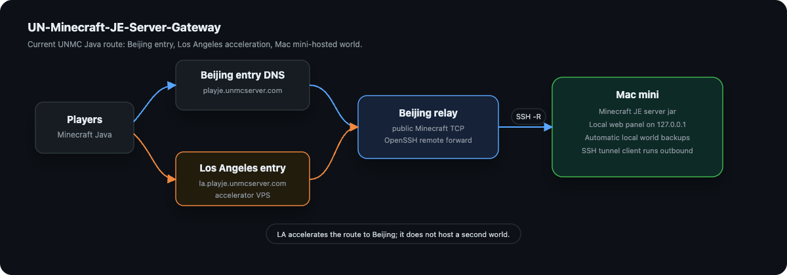
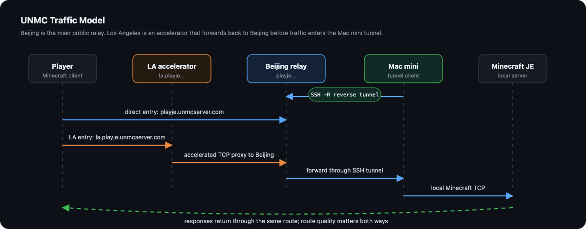
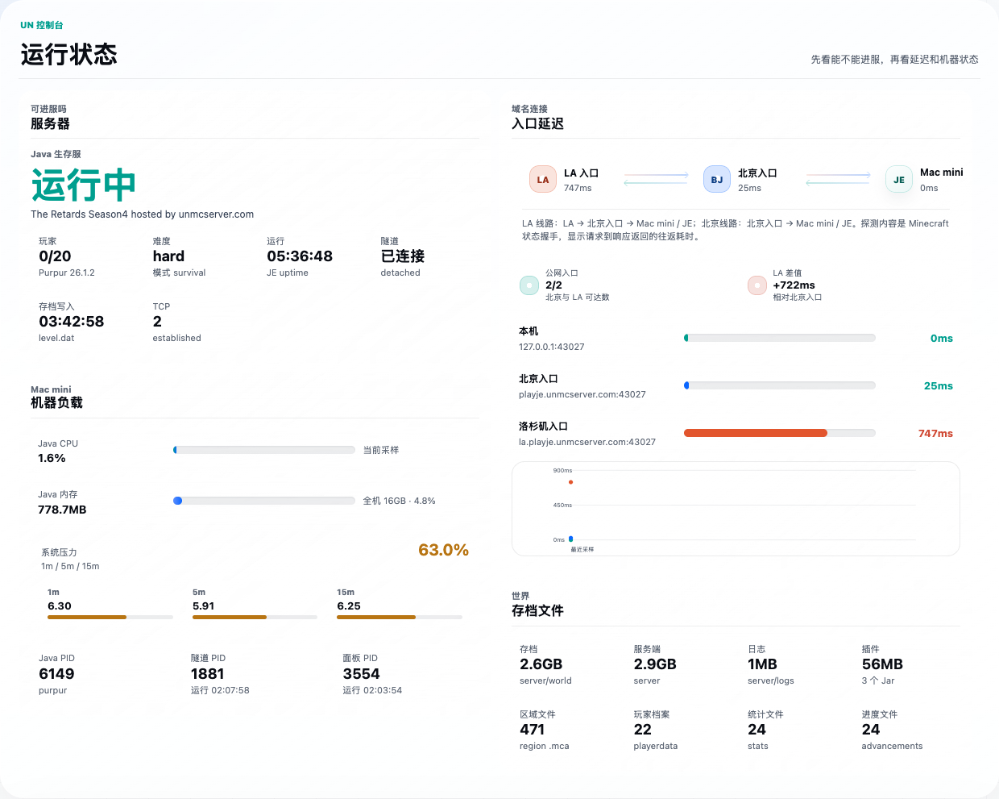
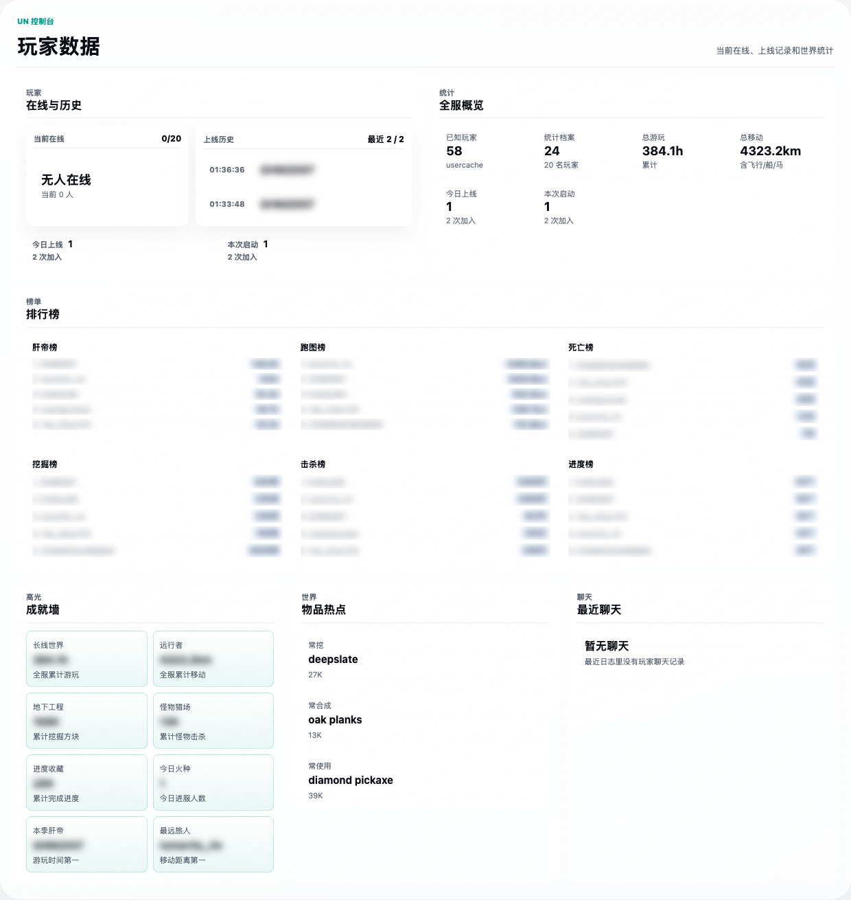
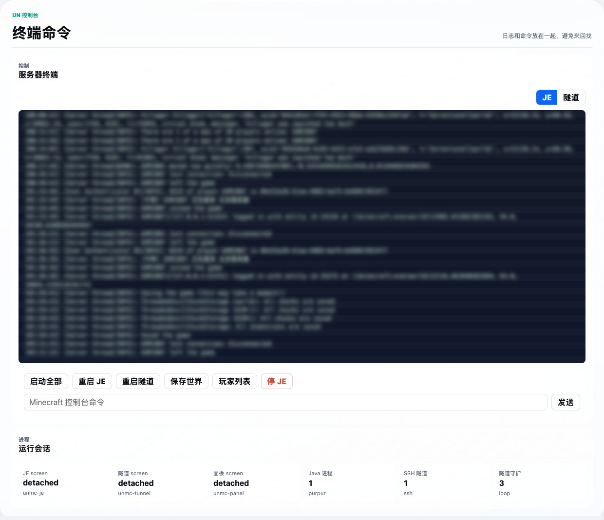
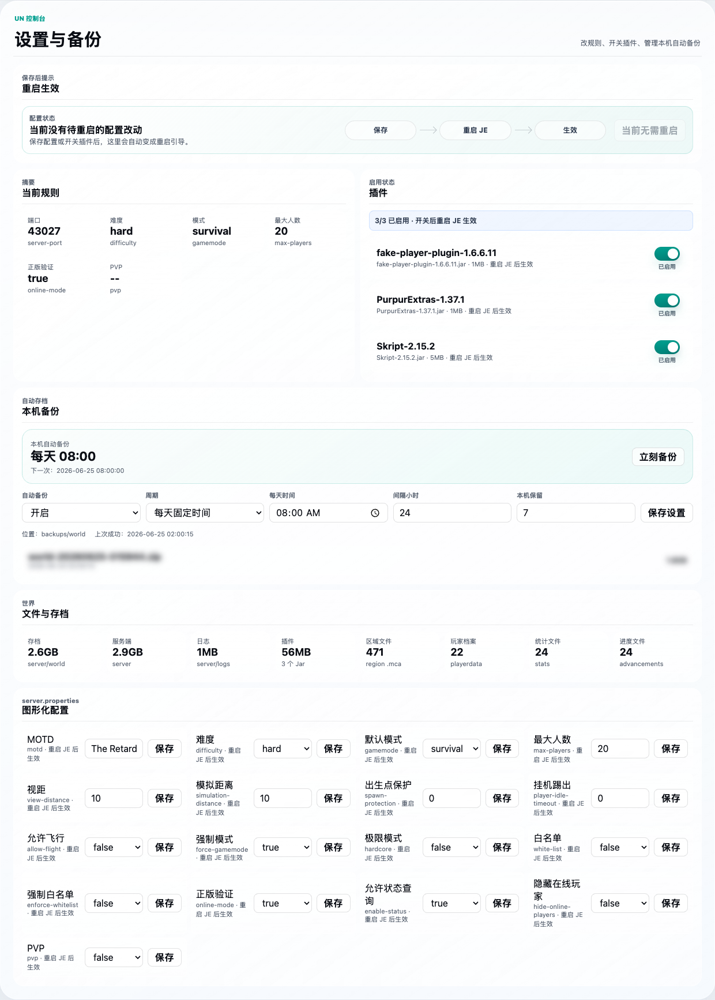

# UN-Minecraft-JE-Server-Gateway

[中文说明点这里](#un-minecraft-je-server-gateway-中文说明)

[](LICENSE)
[](#supported-platforms)
[](#what-this-project-is)

The Mac mini + public relay + optional acceleration server + local web panel stack used by [unmcserver.com](https://unmcserver.com/) to host its Java Minecraft server.

This repository is not just a dashboard. It is a practical infrastructure pattern:

> Run Minecraft Java Edition on a Mac mini at home or in an office, expose it through a public VPS with an SSH reverse tunnel, manage it with a local web panel, and optionally add accelerator servers in other regions for better routing.

---

## What This Project Is

UN-Minecraft-JE-Server-Gateway is the open-source deployment stack behind the Java server architecture used by `unmcserver.com`.

It includes:

- Mac mini side scripts for starting Minecraft Java Edition.
- SSH reverse tunnel scripts for exposing a local Minecraft port through a public relay server.
- The same local web panel UI currently running on the UNMC Mac mini, including the UN logo, glass layout, status pages, logs, commands, player data, plugin toggles, server.properties editing, and local world backups.
- Optional accelerator templates for additional regional entry points.
- Beginner-friendly install scripts and examples.

It does **not** include:

- Minecraft server jar files.
- Minecraft world saves.
- Plugin jar files.

---

## Architecture

The diagrams use the current public `unmcserver.com` Java Edition layout:

- `playje.unmcserver.com` is the Beijing entry and main public relay.
- `la.playje.unmcserver.com` is UNMC's current acceleration entry. An acceleration server can be in any region; it does not have to be Los Angeles.
- UNMC uses Los Angeles because our LA server has a premium/dedicated route toward mainland China, which is much faster for many overseas players than a raw overseas-to-China connection.
- The Mac mini still hosts the actual Minecraft world and the local panel.



### Traffic Model



---

## Panel Screenshots

The screenshots below are captured from the local panel currently running on the UNMC Mac mini. Player names, log text, and backup file names are blurred or redacted before publishing; the UI, layout, logo, and controls are the live panel.

Panel language: the current live panel UI is Chinese-only.

### Overview



### Network And Entry Routes

Network and entry route details are part of the overview status page above.

### Players And Statistics



### Terminal And Commands



### Settings, Plugins And Backups



---

## Supported Platforms

### Mac mini / Minecraft host

Tested target:

- macOS on Apple Silicon.
- Python 3 from macOS Command Line Tools.
- OpenSSH client.
- GNU screen.
- Java runtime from Eclipse Temurin / Adoptium.

Expected to work:

- Intel macOS with Java installed.
- Linux as the Minecraft host with small script adjustments.

### Public relay server

Tested target:

- Ubuntu VPS.
- OpenSSH server.
- Public IPv4 address.
- DNS record pointing to the relay.

Optional acceleration server:

- Any VPS or dedicated server that can proxy TCP traffic to the main relay.
- Nginx stream module or another TCP proxy.

---

## Quick Start

You need two machines:

1. A Mac mini that runs the Minecraft Java server.
2. A public Ubuntu VPS that accepts public Minecraft traffic.

### 1. Prepare the relay VPS

On the Ubuntu VPS:

```bash
sudo bash scripts/setup-relay-ubuntu.sh
```

If you are running this script from a fresh clone on the relay, use:

```bash
git clone https://github.com/Shawn-TV/UN-Minecraft-JE-Server-Gateway.git
cd UN-Minecraft-JE-Server-Gateway
sudo bash scripts/setup-relay-ubuntu.sh
```

This prepares:

- A tunnel user, default `minecraft_tunnel`.
- SSH remote forwarding support.
- Firewall allowance for the Minecraft port.

Then add the Mac mini SSH public key to:

```text
/home/minecraft_tunnel/.ssh/authorized_keys
```

### 2. Prepare the Mac mini

On the Mac mini:

```bash
git clone https://github.com/Shawn-TV/UN-Minecraft-JE-Server-Gateway.git
cd UN-Minecraft-JE-Server-Gateway
cp .env.example .env
```

Edit `.env`:

```bash
REMOTE_HOST=your-relay-vps.yourdomain.com
REMOTE_USER=minecraft_tunnel
MC_ENTRY_HOSTS=play.yourdomain.com
```

Create an SSH key if you do not already have one:

```bash
ssh-keygen -t ed25519 -f ~/.ssh/unmc_tunnel_ed25519
```

Copy the public key to the relay user's `authorized_keys`:

```bash
cat ~/.ssh/unmc_tunnel_ed25519.pub
```

Then run the Mac quick start:

```bash
./scripts/quick-start-mac.sh
```

This script will:

- Create local folders.
- Install a local Java runtime.
- Download the official Minecraft Java server jar.
- Create `server/server.properties`.
- Ask you to accept the Minecraft EULA.

### 3. Start everything

```bash
./scripts/start-all.sh
```

Open the panel:

```text
http://127.0.0.1:8765
```

Players connect to:

```text
play.yourdomain.com
```

or:

```text
play.yourdomain.com:25565
```

depending on the client UI.

---

## DNS Setup

Create an `A` record:

```text
play.yourdomain.com -> your main relay VPS public IP
```

For an optional acceleration server:

```text
acceleration.yourdomain.com -> your acceleration server public IP
```

Then set:

```bash
MC_ENTRY_HOSTS=play.yourdomain.com,acceleration.yourdomain.com
```

The first host is treated as the main relay. Extra hosts are treated as accelerator entries.

---

## Optional Acceleration Server

If you want a second entry point, put a TCP proxy on another VPS or dedicated server. This server can be in any region: Los Angeles, Tokyo, Singapore, Frankfurt, or wherever your players get better routing.

UNMC currently uses this public route shape:

```text
Player -> la.playje.unmcserver.com -> Los Angeles accelerator -> Beijing relay -> SSH tunnel -> Mac mini -> Minecraft JE
```

LA is not a requirement. It is just the current UNMC deployment choice: our LA server has a premium/dedicated route toward mainland China, so it can be much faster than letting overseas players connect to China over ordinary public internet routing.

The direct Beijing route is:

```text
Player -> playje.unmcserver.com -> Beijing relay -> SSH tunnel -> Mac mini -> Minecraft JE
```

For your own deployment, the same pattern would look like:

```text
Player -> acceleration.yourdomain.com -> acceleration server -> play.yourdomain.com -> main relay VPS -> SSH tunnel -> Mac mini
```

See:

```text
templates/nginx-stream-regional-relay.example.conf
```

This is useful when players in some regions get better routing through an acceleration server, even though the final Minecraft server still runs on the Mac mini.

---

## Web Panel

The panel is local by default:

```text
127.0.0.1:8765
```

It currently includes:

- Server status.
- Tunnel status.
- Local and public entry latency checks.
- Player count and recent activity.
- Logs.
- Console command input.
- `server.properties` editing.
- Plugin enable/disable toggles.
- Local automatic backups.
- Backup progress notifications.

Keep the panel on localhost unless you add authentication and HTTPS yourself.

---

## Local Backups

The panel supports local world backups.

Default behavior:

- Enabled.
- Runs daily at 08:00.
- Keeps the latest 7 backup archives.
- Stores backups in `backups/world`.

During a backup, the panel shows a temporary progress notification with the current step and percent.

Backups are intentionally ignored by Git.

---

## Common Commands

Start all services:

```bash
./scripts/start-all.sh
```

Stop all services:

```bash
./scripts/stop-all.sh
```

Start only Minecraft:

```bash
./scripts/start-je-screen.sh
```

Attach to the Minecraft console:

```bash
screen -r unmc-je
```

Detach without stopping the server:

```text
Ctrl-A, then D
```

Start only the tunnel:

```bash
screen -dmS unmc-tunnel ./scripts/tunnel-loop.sh
```

Start only the panel:

```bash
./scripts/start-panel-screen.sh
```

Install launchd autostart on macOS:

```bash
./scripts/install-launchd.sh
```

---

## Configuration

Main configuration file:

```text
.env
```

Important fields:

| Variable | Meaning |
| --- | --- |
| `MC_PORT` | Local Minecraft port. Default `25565`. |
| `MC_ENTRY_HOSTS` | Public hostnames the panel should probe. |
| `REMOTE_HOST` | Main relay VPS hostname or IP. |
| `REMOTE_USER` | SSH user on the relay VPS. |
| `REMOTE_FORWARD_PORT` | Public port opened on the relay. |
| `SSH_KEY_PATH` | SSH private key used by the Mac mini tunnel. |
| `PANEL_PORT` | Local panel port. Default `8765`. |
| `SERVER_JAR_PATTERN` | Which jar in `server/` should be started. |
| `MC_MIN_RAM` / `MC_MAX_RAM` | Java memory limits. |

---

## Dependencies and Related Projects

This stack uses or integrates with:

- [Minecraft Java Edition server](https://www.minecraft.net/) - server software downloaded by the setup script.
- [Eclipse Temurin / Adoptium](https://adoptium.net/) - Java runtime downloaded by `scripts/install-java.sh`.
- [OpenSSH](https://www.openssh.com/) - reverse tunnel transport.
- GNU `screen` - background process sessions.
- Python 3 standard library - web panel backend.
- Browser-native HTML/CSS/JS - web panel frontend.
- Optional [Nginx](https://nginx.org/) stream proxy - regional accelerator relay.
- Optional Paper or Purpur server jars - compatible server implementations, not bundled.

No Minecraft server jar, plugin jar, or world save is included in this repository.

---

## Security Notes

Do not commit:

- `.env`
- SSH private keys.
- `server/`
- `backups/`
- `logs/`
- player data, UUID caches, allowlists, ban lists, or production configs.

Recommended production setup:

- Use a dedicated relay user.
- Do not use `root` for the tunnel.
- Keep the panel bound to `127.0.0.1`.
- Rotate keys if they were ever shared.
- Use firewall rules to expose only the Minecraft port and SSH.
- Back up worlds locally and offsite.

---

## License

GPL-3.0. See [LICENSE](LICENSE).

---

# UN-Minecraft-JE-Server-Gateway 中文说明

[unmcserver.com](https://unmcserver.com/) Java 服务器正在使用的 Mac mini + SSH 反向隧道 + 本地 Web 面板 + 可选地区加速入口方案。

这个项目不是单独的面板，也不是单独的脚本。它是一套完整思路：

> Minecraft Java 服务器跑在 Mac mini 上；北京公网 VPS 负责主入口；Mac mini 主动连 VPS 建立 SSH 反向隧道；本地面板负责查看状态、日志、玩家、配置、插件和备份；如果需要，还可以加一台可选加速服务器。加速服务器不一定要在 LA，UNMC 当前用 LA 是因为这台 LA 服务器到国内线路更好。

---

## 这个项目包含什么

- Mac mini 上启动 Minecraft Java 服务器的脚本。
- 用 SSH 反向隧道把本机 Minecraft 端口暴露到公网 VPS 的脚本。
- 与 UNMC Mac mini 当前正在运行版本一致的本地 Web 面板，包括 UN logo、毛玻璃布局、状态页、日志、指令、玩家数据、插件开关、server.properties 修改和本机备份。
- 自动备份。
- 日志、控制台命令、玩家状态、插件开关、server.properties 图形化修改。
- 可选地区加速入口的配置模板。
- 尽量傻瓜的快速安装脚本。

这个项目不包含：

- Minecraft 服务端 jar。
- 世界存档。
- 插件 jar。

---

## 架构

图里使用的是 `unmcserver.com` 当前公开 Java 服架构：

- `playje.unmcserver.com` 是北京入口，也是主公网 relay。
- `la.playje.unmcserver.com` 是 UNMC 当前使用的加速入口。加速服务器可以在任何地区，不必须是洛杉矶。
- UNMC 当前用洛杉矶，是因为这台 LA 服务器有到国内的专线/优化线路，对很多海外玩家来说会比直接从海外裸链进国内快很多。
- 真正跑世界和面板的机器仍然是 Mac mini。


---

## 面板截图

下面的截图直接来自 UNMC Mac mini 本机正在运行的面板。玩家名、日志正文和备份文件名在发布前做了模糊或隐藏；UI、布局、logo 和控件是当前实机版本。

面板语言：当前实机面板界面只有中文。

### 运行总览


### 网络入口

网络入口和路径延迟已经包含在上面的运行总览里。

### 玩家统计


### 终端命令


### 设置、插件和备份


---

## 支持平台

Mac mini 侧：

- macOS，Apple Silicon 优先。
- Python 3。
- OpenSSH。
- GNU screen。
- Eclipse Temurin / Adoptium Java 运行时。

公网服务器侧：

- Ubuntu VPS。
- OpenSSH server。
- 有公网 IPv4。
- 域名 A 记录指向 VPS。

可选地区入口：

- 任意能做 TCP 代理的 VPS。
- 可使用 Nginx stream。

---

## 快速开始

你需要两台机器：

1. Mac mini：真正运行 Minecraft Java 服务器。
2. Ubuntu VPS：公网入口，玩家连它。

### 1. 准备公网 VPS

在 Ubuntu VPS 上运行：

```bash
git clone https://github.com/Shawn-TV/UN-Minecraft-JE-Server-Gateway.git
cd UN-Minecraft-JE-Server-Gateway
sudo bash scripts/setup-relay-ubuntu.sh
```

它会准备：

- 专用隧道用户，默认 `minecraft_tunnel`。
- SSH 远程端口转发。
- Minecraft 端口防火墙规则。

然后把 Mac mini 的 SSH 公钥放到：

```text
/home/minecraft_tunnel/.ssh/authorized_keys
```

### 2. 准备 Mac mini

在 Mac mini 上：

```bash
git clone https://github.com/Shawn-TV/UN-Minecraft-JE-Server-Gateway.git
cd UN-Minecraft-JE-Server-Gateway
cp .env.example .env
```

编辑 `.env`：

```bash
REMOTE_HOST=你的公网VPS域名或IP
REMOTE_USER=minecraft_tunnel
MC_ENTRY_HOSTS=play.yourdomain.com
```

如果还没有 SSH key：

```bash
ssh-keygen -t ed25519 -f ~/.ssh/unmc_tunnel_ed25519
```

把公钥复制到 VPS：

```bash
cat ~/.ssh/unmc_tunnel_ed25519.pub
```

然后运行：

```bash
./scripts/quick-start-mac.sh
```

这个脚本会：

- 创建本地目录。
- 安装 Java。
- 下载官方 Minecraft Java 服务端。
- 生成 `server/server.properties`。
- 要求你确认 Minecraft EULA。

### 3. 启动

```bash
./scripts/start-all.sh
```

打开面板：

```text
http://127.0.0.1:8765
```

玩家连接：

```text
play.yourdomain.com
```

---

## 域名设置

主入口：

```text
play.yourdomain.com -> 主公网 VPS IP
```

可选地区入口：

```text
acceleration.yourdomain.com -> 可选加速服务器公网 IP
```

`.env` 里写：

```bash
MC_ENTRY_HOSTS=play.yourdomain.com,acceleration.yourdomain.com
```

第一个域名会被当作主入口，后面的当作地区加速入口。

UNMC 当前公开参考架构是：

```text
北京入口：playje.unmcserver.com -> 北京 relay -> SSH 反向隧道 -> Mac mini -> Minecraft JE
LA 入口：la.playje.unmcserver.com -> 洛杉矶加速 VPS -> 北京 relay -> SSH 反向隧道 -> Mac mini -> Minecraft JE
```

这里的 LA 只是 UNMC 当前实例，不是项目要求。我们用 LA 的原因是这台洛杉矶服务器到国内有专线/优化线路，比海外玩家直接裸连国内入口稳定、快速很多。你自己的部署可以把加速服务器放在任意地区，例如：

```text
玩家 -> acceleration.yourdomain.com -> 加速服务器 -> play.yourdomain.com -> 主公网 VPS -> SSH 反向隧道 -> Mac mini
```

---

## 本地面板

默认地址：

```text
127.0.0.1:8765
```

功能包括：

- 服务器运行状态。
- 隧道状态。
- 本机和公网入口延迟。
- 玩家数量和最近活动。
- 日志。
- 控制台命令。
- server.properties 图形化修改。
- 插件启用/禁用。
- 本机自动备份。
- 备份时弹出实时进度。

不要直接把面板暴露到公网。默认只监听本机是刻意设计。

---

## 备份

默认：

- 开启。
- 每天 08:00 备份。
- 本机保留最近 7 份。
- 存到 `backups/world`。

备份时面板会临时弹出进度提示，显示当前步骤和百分比。

---

## 常用命令

启动全部：

```bash
./scripts/start-all.sh
```

停止全部：

```bash
./scripts/stop-all.sh
```

进入 Minecraft 控制台：

```bash
screen -r unmc-je
```

退出控制台但不关服：

```text
Ctrl-A，然后 D
```

安装 Mac 登录后自动启动：

```bash
./scripts/install-launchd.sh
```

---

## 用到的项目

- Minecraft Java Edition server。
- Eclipse Temurin / Adoptium Java。
- OpenSSH。
- GNU screen。
- Python 3 标准库。
- HTML/CSS/JavaScript。
- 可选 Nginx stream。
- 可选 Paper / Purpur 服务端。

本仓库不内置 Minecraft jar、插件 jar 和世界存档。

---

## 安全提醒

不要提交：

- `.env`
- SSH 私钥
- `server/`
- `backups/`
- `logs/`
- 玩家数据、UUID 缓存、白名单、封禁列表、真实生产配置

生产环境建议：

- 隧道使用专用用户。
- 不要用 root 跑隧道。
- 面板保持 `127.0.0.1`。
- 密钥泄露后立刻换。
- VPS 只开放 SSH 和 Minecraft 端口。
- 世界存档做本地和异地双备份。

---

## 许可证

GPL-3.0，见 [LICENSE](LICENSE)。
