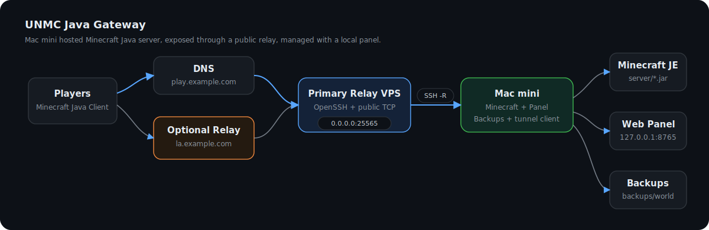
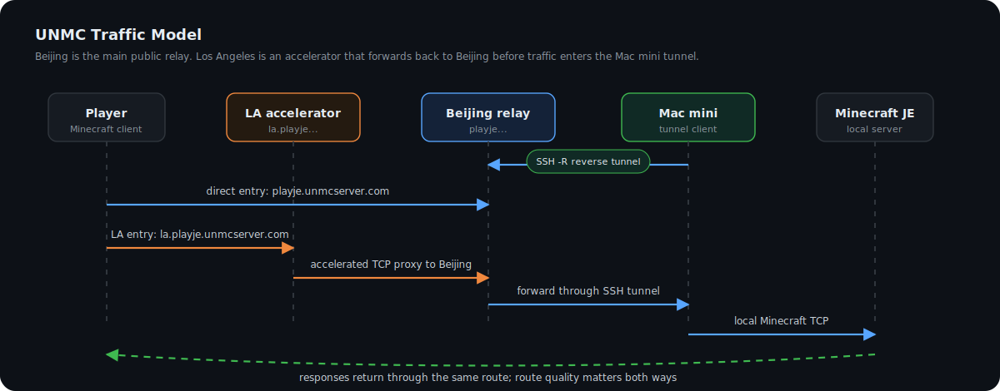

# UNMC Java Gateway

[](LICENSE)
[](#supported-platforms)
[](#what-this-project-is)

The Mac mini + reverse tunnel + web panel + optional regional relay stack used by [unmcserver.com](https://unmcserver.com/) to host its Java Minecraft server.

This repository is not just a dashboard. It is a practical infrastructure pattern:

> Run Minecraft Java Edition on a Mac mini at home or in an office, expose it through a public VPS with an SSH reverse tunnel, manage it with a local web panel, and optionally add regional relay servers for better routing.

---

## What This Project Is

UNMC Java Gateway is the open-source deployment stack behind the Java server architecture used by `unmcserver.com`.

It includes:

- Mac mini side scripts for starting Minecraft Java Edition.
- SSH reverse tunnel scripts for exposing a local Minecraft port through a public relay server.
- A local web panel for status, logs, commands, player data, plugin toggles, server.properties editing, and local world backups.
- Optional relay templates for additional regional entry points.
- Beginner-friendly install scripts and examples.

It does **not** include:

- Minecraft server jar files.
- Minecraft world saves.
- Plugin jar files.
- SSH keys.
- Production IPs, passwords, logs, backups, or private deployment data.

---

## Architecture



### Traffic Model



---

## Supported Platforms

### Mac mini / Minecraft host

Tested target:

- macOS on Apple Silicon.
- Python 3 from macOS Command Line Tools.
- OpenSSH client.
- GNU screen.
- Java runtime from Eclipse Temurin / Adoptium.

Expected to work:

- Intel macOS with Java installed.
- Linux as the Minecraft host with small script adjustments.

### Public relay server

Tested target:

- Ubuntu VPS.
- OpenSSH server.
- Public IPv4 address.
- DNS record pointing to the relay.

Optional regional relay:

- Any VPS that can proxy TCP traffic to the primary relay.
- Nginx stream module or another TCP proxy.

---

## Quick Start

You need two machines:

1. A Mac mini that runs the Minecraft Java server.
2. A public Ubuntu VPS that accepts public Minecraft traffic.

### 1. Prepare the relay VPS

On the Ubuntu VPS:

```bash
sudo bash scripts/setup-relay-ubuntu.sh
```

If you are running this script from a fresh clone on the relay, use:

```bash
git clone https://github.com/Shawn-TV/unmc-java-gateway.git
cd unmc-java-gateway
sudo bash scripts/setup-relay-ubuntu.sh
```

This prepares:

- A tunnel user, default `minecraft_tunnel`.
- SSH remote forwarding support.
- Firewall allowance for the Minecraft port.

Then add the Mac mini SSH public key to:

```text
/home/minecraft_tunnel/.ssh/authorized_keys
```

### 2. Prepare the Mac mini

On the Mac mini:

```bash
git clone https://github.com/Shawn-TV/unmc-java-gateway.git
cd unmc-java-gateway
cp .env.example .env
```

Edit `.env`:

```bash
REMOTE_HOST=your-relay-vps.example.com
REMOTE_USER=minecraft_tunnel
MC_ENTRY_HOSTS=play.example.com
```

Create an SSH key if you do not already have one:

```bash
ssh-keygen -t ed25519 -f ~/.ssh/unmc_tunnel_ed25519
```

Copy the public key to the relay user's `authorized_keys`:

```bash
cat ~/.ssh/unmc_tunnel_ed25519.pub
```

Then run the Mac quick start:

```bash
./scripts/quick-start-mac.sh
```

This script will:

- Create local folders.
- Install a local Java runtime.
- Download the official Minecraft Java server jar.
- Create `server/server.properties`.
- Ask you to accept the Minecraft EULA.

### 3. Start everything

```bash
./scripts/start-all.sh
```

Open the panel:

```text
http://127.0.0.1:8765
```

Players connect to:

```text
play.example.com
```

or:

```text
play.example.com:25565
```

depending on the client UI.

---

## DNS Setup

Create an `A` record:

```text
play.example.com -> your primary relay VPS public IP
```

For an optional regional relay:

```text
la.example.com -> your regional relay VPS public IP
```

Then set:

```bash
MC_ENTRY_HOSTS=play.example.com,la.example.com
```

The first host is treated as the primary relay. Extra hosts are treated as regional relays.

---

## Optional Regional Relay

If you want a second entry point, put a TCP proxy on another VPS.

Example:

```text
Player -> la.example.com -> regional VPS -> play.example.com -> primary VPS -> SSH tunnel -> Mac mini
```

See:

```text
templates/nginx-stream-regional-relay.example.conf
```

This is useful when players in some regions get better routing to a different VPS, even though the final Minecraft server still runs on the Mac mini.

---

## Web Panel

The panel is local by default:

```text
127.0.0.1:8765
```

It currently includes:

- Server status.
- Tunnel status.
- Local and public entry latency checks.
- Player count and recent activity.
- Logs.
- Console command input.
- `server.properties` editing.
- Plugin enable/disable toggles.
- Local automatic backups.
- Backup progress notifications.

Keep the panel on localhost unless you add authentication and HTTPS yourself.

---

## Local Backups

The panel supports local world backups.

Default behavior:

- Enabled.
- Runs daily at 08:00.
- Keeps the latest 7 backup archives.
- Stores backups in `backups/world`.

During a backup, the panel shows a temporary progress notification with the current step and percent.

Backups are intentionally ignored by Git.

---

## Common Commands

Start all services:

```bash
./scripts/start-all.sh
```

Stop all services:

```bash
./scripts/stop-all.sh
```

Start only Minecraft:

```bash
./scripts/start-je-screen.sh
```

Attach to the Minecraft console:

```bash
screen -r unmc-je
```

Detach without stopping the server:

```text
Ctrl-A, then D
```

Start only the tunnel:

```bash
screen -dmS unmc-tunnel ./scripts/tunnel-loop.sh
```

Start only the panel:

```bash
./scripts/start-panel-screen.sh
```

Install launchd autostart on macOS:

```bash
./scripts/install-launchd.sh
```

---

## Configuration

Main configuration file:

```text
.env
```

Important fields:

| Variable | Meaning |
| --- | --- |
| `MC_PORT` | Local Minecraft port. Default `25565`. |
| `MC_ENTRY_HOSTS` | Public hostnames the panel should probe. |
| `REMOTE_HOST` | Primary relay VPS hostname or IP. |
| `REMOTE_USER` | SSH user on the relay VPS. |
| `REMOTE_FORWARD_PORT` | Public port opened on the relay. |
| `SSH_KEY_PATH` | SSH private key used by the Mac mini tunnel. |
| `PANEL_PORT` | Local panel port. Default `8765`. |
| `SERVER_JAR_PATTERN` | Which jar in `server/` should be started. |
| `MC_MIN_RAM` / `MC_MAX_RAM` | Java memory limits. |

---

## Dependencies and Related Projects

This stack uses or integrates with:

- [Minecraft Java Edition server](https://www.minecraft.net/) - server software downloaded by the setup script.
- [Eclipse Temurin / Adoptium](https://adoptium.net/) - Java runtime downloaded by `scripts/install-java.sh`.
- [OpenSSH](https://www.openssh.com/) - reverse tunnel transport.
- GNU `screen` - background process sessions.
- Python 3 standard library - web panel backend.
- Browser-native HTML/CSS/JS - web panel frontend.
- Optional [Nginx](https://nginx.org/) stream proxy - regional relay.
- Optional Paper or Purpur server jars - compatible server implementations, not bundled.

No Minecraft server jar, plugin jar, world save, key, or private deployment artifact is included in this repository.

---

## Security Notes

Do not commit:

- `.env`
- SSH private keys.
- `server/`
- `backups/`
- `logs/`
- player data, UUID caches, allowlists, ban lists, or production configs.

Recommended production setup:

- Use a dedicated relay user.
- Do not use `root` for the tunnel.
- Keep the panel bound to `127.0.0.1`.
- Rotate keys if they were ever shared.
- Use firewall rules to expose only the Minecraft port and SSH.
- Back up worlds locally and offsite.

---

## License

GPL-3.0. See [LICENSE](LICENSE).

---

# UNMC Java Gateway 中文说明

[unmcserver.com](https://unmcserver.com/) Java 服务器正在使用的 Mac mini + SSH 反向隧道 + 本地 Web 面板 + 可选地区加速入口方案。

这个项目不是单独的面板，也不是单独的脚本。它是一套完整思路：

> Minecraft Java 服务器跑在 Mac mini 上；公网 VPS 负责接受玩家连接；Mac mini 主动连 VPS 建立 SSH 反向隧道；本地面板负责查看状态、日志、玩家、配置、插件和备份；如果需要，还可以加其他地区的 VPS 做入口加速。

---

## 这个项目包含什么

- Mac mini 上启动 Minecraft Java 服务器的脚本。
- 用 SSH 反向隧道把本机 Minecraft 端口暴露到公网 VPS 的脚本。
- 本地 Web 面板。
- 自动备份。
- 日志、控制台命令、玩家状态、插件开关、server.properties 图形化修改。
- 可选地区 relay 的配置模板。
- 尽量傻瓜的快速安装脚本。

这个项目不包含：

- Minecraft 服务端 jar。
- 世界存档。
- 插件 jar。
- SSH 密钥。
- 生产 IP、密码、日志、备份和私有配置。

---

## 架构


---

## 支持平台

Mac mini 侧：

- macOS，Apple Silicon 优先。
- Python 3。
- OpenSSH。
- GNU screen。
- Eclipse Temurin / Adoptium Java 运行时。

公网服务器侧：

- Ubuntu VPS。
- OpenSSH server。
- 有公网 IPv4。
- 域名 A 记录指向 VPS。

可选地区入口：

- 任意能做 TCP 代理的 VPS。
- 可使用 Nginx stream。

---

## 快速开始

你需要两台机器：

1. Mac mini：真正运行 Minecraft Java 服务器。
2. Ubuntu VPS：公网入口，玩家连它。

### 1. 准备公网 VPS

在 Ubuntu VPS 上运行：

```bash
git clone https://github.com/Shawn-TV/unmc-java-gateway.git
cd unmc-java-gateway
sudo bash scripts/setup-relay-ubuntu.sh
```

它会准备：

- 专用隧道用户，默认 `minecraft_tunnel`。
- SSH 远程端口转发。
- Minecraft 端口防火墙规则。

然后把 Mac mini 的 SSH 公钥放到：

```text
/home/minecraft_tunnel/.ssh/authorized_keys
```

### 2. 准备 Mac mini

在 Mac mini 上：

```bash
git clone https://github.com/Shawn-TV/unmc-java-gateway.git
cd unmc-java-gateway
cp .env.example .env
```

编辑 `.env`：

```bash
REMOTE_HOST=你的公网VPS域名或IP
REMOTE_USER=minecraft_tunnel
MC_ENTRY_HOSTS=play.example.com
```

如果还没有 SSH key：

```bash
ssh-keygen -t ed25519 -f ~/.ssh/unmc_tunnel_ed25519
```

把公钥复制到 VPS：

```bash
cat ~/.ssh/unmc_tunnel_ed25519.pub
```

然后运行：

```bash
./scripts/quick-start-mac.sh
```

这个脚本会：

- 创建本地目录。
- 安装 Java。
- 下载官方 Minecraft Java 服务端。
- 生成 `server/server.properties`。
- 要求你确认 Minecraft EULA。

### 3. 启动

```bash
./scripts/start-all.sh
```

打开面板：

```text
http://127.0.0.1:8765
```

玩家连接：

```text
play.example.com
```

---

## 域名设置

主入口：

```text
play.example.com -> 主公网 VPS IP
```

可选地区入口：

```text
la.example.com -> 地区 VPS IP
```

`.env` 里写：

```bash
MC_ENTRY_HOSTS=play.example.com,la.example.com
```

第一个域名会被当作主入口，后面的当作地区入口。

---

## 本地面板

默认地址：

```text
127.0.0.1:8765
```

功能包括：

- 服务器运行状态。
- 隧道状态。
- 本机和公网入口延迟。
- 玩家数量和最近活动。
- 日志。
- 控制台命令。
- server.properties 图形化修改。
- 插件启用/禁用。
- 本机自动备份。
- 备份时弹出实时进度。

不要直接把面板暴露到公网。默认只监听本机是刻意设计。

---

## 备份

默认：

- 开启。
- 每天 08:00 备份。
- 本机保留最近 7 份。
- 存到 `backups/world`。

备份时面板会临时弹出进度提示，显示当前步骤和百分比。

---

## 常用命令

启动全部：

```bash
./scripts/start-all.sh
```

停止全部：

```bash
./scripts/stop-all.sh
```

进入 Minecraft 控制台：

```bash
screen -r unmc-je
```

退出控制台但不关服：

```text
Ctrl-A，然后 D
```

安装 Mac 登录后自动启动：

```bash
./scripts/install-launchd.sh
```

---

## 用到的项目

- Minecraft Java Edition server。
- Eclipse Temurin / Adoptium Java。
- OpenSSH。
- GNU screen。
- Python 3 标准库。
- HTML/CSS/JavaScript。
- 可选 Nginx stream。
- 可选 Paper / Purpur 服务端。

本仓库不内置 Minecraft jar、插件 jar、世界存档、密钥和生产配置。

---

## 安全提醒

不要提交：

- `.env`
- SSH 私钥
- `server/`
- `backups/`
- `logs/`
- 玩家数据、UUID 缓存、白名单、封禁列表、真实生产配置

生产环境建议：

- 隧道使用专用用户。
- 不要用 root 跑隧道。
- 面板保持 `127.0.0.1`。
- 密钥泄露后立刻换。
- VPS 只开放 SSH 和 Minecraft 端口。
- 世界存档做本地和异地双备份。

---

## 许可证

GPL-3.0，见 [LICENSE](LICENSE)。
